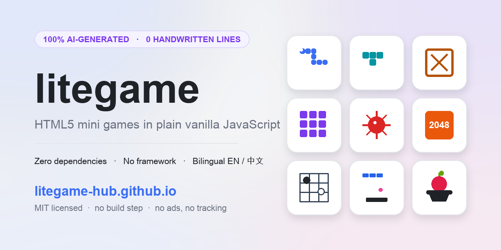

# litegame

**[简体中文](README.zh.md)** · [English](README.md)

[](#游戏列表)
[](#这个项目是怎么做出来的)
[](#为什么是-litegame)
[](https://developer.mozilla.org/zh-CN/docs/Web/JavaScript)
[](#为什么是-litegame)
[](LICENSE)
[](https://github.com/gtdong/litegame/actions/workflows/smoke.yml)
[](https://github.com/gtdong/litegame/commits)
[](https://github.com/gtdong/litegame)
[](https://github.com/gtdong/litegame/stargazers)



---

**13 款零依赖的 HTML5 小游戏，全部用原生 JavaScript 手写 —— 100% 由 AI 生成，零手写代码。** 浏览器打开 `index.html` 就能玩 —— 不用构建、不用框架、不用 `npm install`。

### ▶ 在线试玩：<https://litegame-hub.github.io/>

> 如果这些游戏让你玩得开心，点个 ⭐ **Star** 能让更多人发现它。

## 游戏列表

每个游戏各占一个目录，都是一个自包含的 `index.html`。标签标注了它的玩法类型。

| 游戏 | 说明 | 标签 |
| --- | --- | --- |
| [snake-game](snake-game) | 贪吃蛇，吃食物变长，别咬到自己 | `街机` `Canvas` `滑动` |
| [gomoku-game](gomoku-game) | 五子棋，含三三 / 四四 / 长连禁手 | `棋类` `AI` `双人` |
| [xiangqi-game](xiangqi-game) | 中国象棋，内置引擎三档难度 | `棋类` `AI` `策略` |
| [2048-game](2048-game) | 滑动合并数字，凑出 2048 | `益智` `滑动` `撤销` |
| [minesweeper-game](minesweeper-game) | 扫雷，首点永不踩雷 | `益智` `逻辑` `难度` |
| [breakout-game](breakout-game) | 打砖块，关卡越高球速越快 | `街机` `Canvas` `关卡` |
| [memory-game](memory-game) | 记忆翻牌，配对全部表情 | `卡牌` `记忆` `儿童` |
| [tictactoe-game](tictactoe-game) | 井字棋，从不会输的 Minimax AI | `棋类` `AI` `Minimax` |
| [whackmole-game](whackmole-game) | 打地鼠，30 秒一局，炸弹扣分 | `反应` `限时` `键盘` |
| [sudoku-game](sudoku-game) | 数独，唯一解出题 + 笔记模式 | `益智` `逻辑` `出题器` |
| [fruitcatcher-game](fruitcatcher-game) | 接水果，躲开炸弹，等级越高越刺激 | `街机` `Canvas` `关卡` |
| [tetris-game](tetris-game) | 俄罗斯方块，SRS / 7-bag / 暂存 / 幽灵 / T-spin | `街机` `Canvas` `SRS` |
| [sokoban-game](sokoban-game) | 推箱子，10 关只能推不能拉，支持撤销 | `益智` `关卡` `撤销` |

## 为什么是 litegame

- **零依赖** —— 没有东西要安装，没有东西要审计，也没有东西会坏。
- **无构建步骤** —— 仓库里的文件就是最终产物，clone 下来双击即可。
- **真·原生** —— 纯 HTML / CSS / JavaScript，不用框架、不用打包器、不用转译器。
- **中英双语界面** —— 每个游戏都能在中英文间切换，靠的是一个共享的 2 KB i18n 模块。
- **处处能玩** —— 桌面端键盘鼠标，手机端点按滑动；每个游戏都会自适应铺满屏幕。
- **有测试** —— 冒烟套件在桩 DOM 里加载全部 13 款游戏，另有专项逻辑测试（俄罗斯方块 98 项、推箱子 104 项）。
- **从头到尾由 AI 写成** —— 约 9,000 行 HTML / CSS / JavaScript，没有一行是手敲的。详见[这个项目是怎么做出来的](#这个项目是怎么做出来的)。

## 这个项目是怎么做出来的

**这个仓库里的每一行代码都是 AI 写的，没有一行是手敲的。**

人在这个循环里只做两件事：描述一个游戏，看结果，指出哪里不对，然后要下一个。AI 那边负责：写 HTML / CSS / JavaScript，写测试，跑测试，修掉失败的地方，提交。

```text
prompt  ->  生成  ->  跑测试  ->  浏览器里验收  ->  修  ->  发布
```

这也是为什么下面两条铁律不容商量。一个偷偷引入框架和构建工具的 AI 代码库是没法审阅的；这里的全部价值就在于，你随便打开哪个文件都能从头读到尾。

- 13 款游戏 + 一个首页，约 9,000 行，零依赖、零构建。
- 测试也是同样方式写出来的，而它们是让这一堆代码不烂掉的关键：冒烟套件加载每一款游戏，规则复杂的游戏另有专项逻辑测试（俄罗斯方块 98 项、推箱子 104 项），证明的是游戏**真能玩**，而不只是能加载。
- 那些 Bug 也都留在提交历史里了 —— 俄罗斯方块里按住状态永远读不到的 ↓ 键、箱子根本推不动的推箱子关卡、玩家根本进不去的开始界面。把这些问题公开地找出来修掉，本身就是重点之一。

如果你想看看 AI 在无人辅助的情况下能做成什么样，这里算是一个还算诚实的样本。想知道它哪里还得靠人，去读提交日志。

## 技术实现

- 纯 `HTML` / `CSS` / `JavaScript`，用 DOM 元素渲染，值得的地方才上 `<canvas>`。
- 共享 i18n 工具：[`assets/i18n.js`](assets/i18n.js) —— 约 2 KB、零依赖，语言偏好存在 `localStorage`。
- 直接用 **GitHub Pages** 从仓库发布（`.nojekyll` 让流水线别插手）。

## Topics

`html5-games` · `javascript-games` · `browser-games` · `mini-games` · `vanilla-javascript` · `zero-dependencies` · `ai-generated` · `vibe-coding` · `github-pages` · `game-development` · `puzzle-game` · `canvas` · `tetris` · `sokoban` · `sudoku` · `minesweeper` · `snake-game` · `2048` · `gomoku` · `chinese-chess`

## 仓库结构

```text
litegame/
├── index.html              # 首页：游戏卡片墙 + 随机挑选
├── assets/
│   ├── i18n.js             # 共享语言切换模块
│   └── social-preview.png  # 链接预览横幅
├── <game>-game/            # 每个游戏一个自包含目录
│   ├── index.html
│   ├── README.md           # 英文
│   └── README.zh.md        # 简体中文
├── tools/                  # 冒烟测试、各游戏专项逻辑测试、横幅生成脚本
├── .github/                # CI 工作流、Issue 表单、PR 模板
└── robots.txt / sitemap.xml  # 给搜索引擎的站点提示
```

## 自己加一个游戏

1. 复制一个现成的 `<game>-game/` 目录并改名。
2. 把 `index.html` 里的游戏逻辑换成你的。
3. 在根 `index.html` 的卡片墙、它的 JSON-LD `ItemList`、上面的表格、以及 `sitemap.xml` 里各加一条。
4. 跑 `node tools/smoke.js` —— 它会自动发现所有 `*-game/` 目录，任何未捕获异常都会让它失败。
5. 提一个 Pull Request。先看看 [CONTRIBUTING.zh.md](CONTRIBUTING.zh.md)。

## 参与贡献

欢迎提 Bug、加新游戏、补翻译或打磨视觉。开始前请先读一遍 [CONTRIBUTING.zh.md](CONTRIBUTING.zh.md)，它很短。

## 开源许可

基于 [MIT License](LICENSE) 发布。玩得开心。
